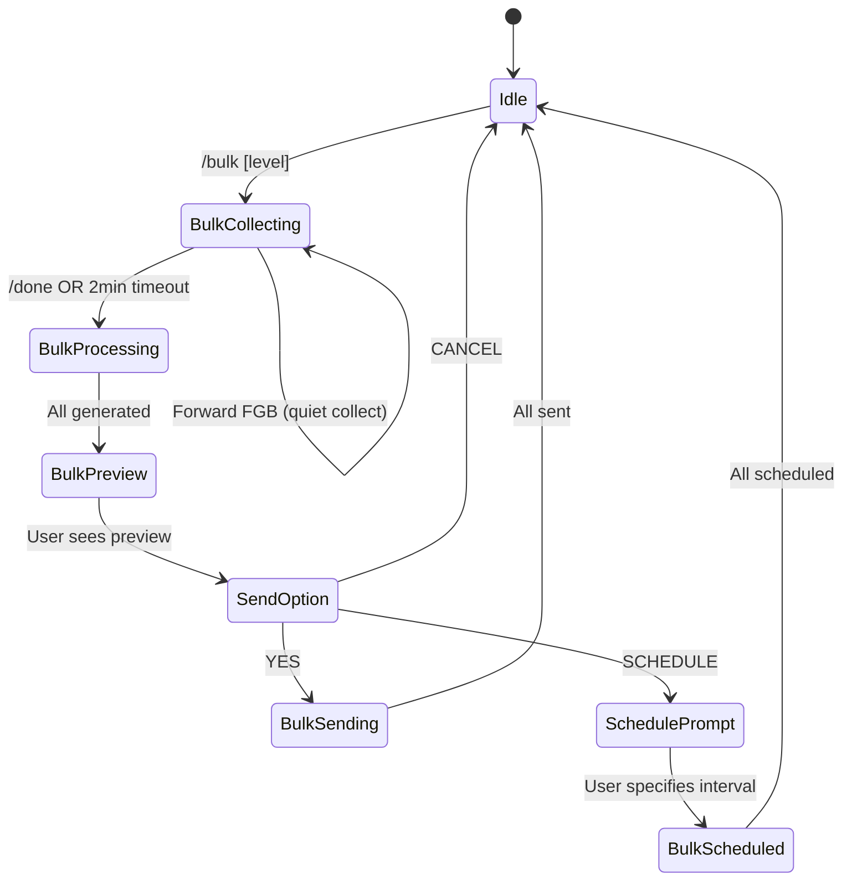

# Bulk Forward Mode Feature

Add `/bulk [level]` command to handle multiple FGB broadcast forwards at once, with consolidated preview, random delays, and scheduling options.

## User Review Required

> [!IMPORTANT]
> **Schedule Interval Confirmation**: For scheduled bulk, user can specify custom interval (e.g., "schedule 30" for 30 minutes between each). Is this the expected UX or should we offer presets (15/30/45/60 min)?

---

## Proposed Changes

### WA Bot Service

#### [MODIFY] [messageHandler.ts](file:///Users/faiqnau/fight/bot-wa-bookstore/wa-bot/src/messageHandler.ts)

**1. Add BulkState Interface**

```typescript
interface BulkState {
  active: boolean;
  level: number;  // 1, 2, or 3
  items: BulkItem[];
  startedAt: number;
  timeoutId?: NodeJS.Timeout;
}

interface BulkItem {
  parsedData: ParsedBroadcast;
  mediaPaths: string[];
  generated?: {
    draft: string;
    error?: string;
  };
}
```

**2. Add Commands**

| Command | Description |
|---------|-------------|
| `/bulk` | Start bulk mode with default level 2 |
| `/bulk 1` | Start bulk mode with level 1 (Standard) |
| `/bulk 2` | Start bulk mode with level 2 (Recommended) |
| `/bulk 3` | Start bulk mode with level 3 (Racun) |
| `/done` | Finish collecting, start processing |

**3. Flow Logic**



**4. Consolidated Preview Format (Text Only)**

```
📦 *BULK PREVIEW* (3 broadcasts, Level 2)

━━━━━━━━━━━━━━━━━━━━
1️⃣ *The Science Encyclopedia*
PO Close 25 Des | ETA Apr '26
HB | Rp 455.000

Moms, buku ini...
[AI review paragraph]

📎 Preview: https://instagram.com/...
━━━━━━━━━━━━━━━━━━━━
2️⃣ *100 First Words*
PO Close 25 Des | ETA Mar '26
BB | Rp 175.000

Buku ini cocok banget...
[AI review paragraph]
━━━━━━━━━━━━━━━━━━━━
3️⃣ *My First Coding Book*
...

---
Reply:
• *YES* - Kirim semua sekarang (random 15-30 detik antar pesan)
• *SCHEDULE 30* - Jadwalkan tiap 30 menit
• *CANCEL* - Batalkan semua
```

**5. Bulk Sending Logic**

```typescript
async sendBulkBroadcasts(items: BulkItem[]) {
  for (let i = 0; i < items.length; i++) {
    const item = items[i];
    
    // Skip failed items
    if (item.generated?.error) continue;
    
    // Send to group
    await this.sendToGroup(item);
    
    // Random delay 15-30 seconds (except last item)
    if (i < items.length - 1) {
      const delay = 15000 + Math.random() * 15000; // 15-30s
      await sleep(delay);
    }
  }
}
```

**6. Schedule Logic**

```typescript
async scheduleBulkBroadcasts(items: BulkItem[], intervalMinutes: number) {
  const now = Date.now();
  
  for (let i = 0; i < items.length; i++) {
    const item = items[i];
    if (item.generated?.error) continue;
    
    const scheduledTime = new Date(now + (i * intervalMinutes * 60 * 1000));
    
    // For MVP: Use setTimeout (in-memory)
    // Future: Persist to database queue
    setTimeout(() => {
      this.sendToGroup(item);
    }, i * intervalMinutes * 60 * 1000);
  }
  
  return `Scheduled ${items.length} broadcasts, ${intervalMinutes} min apart`;
}
```

**7. Error Handling**

When 1 of N fails:
```
⚠️ *Warning*: 1 of 3 failed to generate
- ❌ "Some Book Title" - Error: API timeout

Continuing with 2 successful broadcasts:
[shows preview of 2 successful ones]
```

---

### Help Command Update

#### [MODIFY] [messageHandler.ts](file:///Users/faiqnau/fight/bot-wa-bookstore/wa-bot/src/messageHandler.ts)

Update `sendHelp()` to include:

```
*Bulk Mode:*
/bulk [1|2|3] - Mulai bulk mode (default level 2)
/done - Selesai collect, mulai proses
```

---

## Files Summary

| File | Action | Changes |
|------|--------|---------|
| `wa-bot/src/messageHandler.ts` | MODIFY | Add BulkState, /bulk, /done, bulk processing |

---

## Verification Plan

### Manual Testing

1. **Basic Bulk Flow**
   - Send `/bulk 2`
   - Forward 3 FGB broadcasts
   - Send `/done`
   - Verify consolidated preview appears
   - Reply `YES`
   - Verify all 3 sent to group with 15-30s delays

2. **Schedule Mode**
   - Send `/bulk`
   - Forward 2 broadcasts
   - Send `/done`
   - Reply `SCHEDULE 1` (1 minute for testing)
   - Verify scheduled confirmation
   - Wait and verify broadcasts sent at intervals

3. **Error Handling**
   - Forward 3 broadcasts (including 1 with invalid format)
   - Verify warning shows for failed one
   - Verify other 2 still work

4. **Timeout Test**
   - Send `/bulk`
   - Forward 1 broadcast
   - Wait 2 minutes without `/done`
   - Verify auto-triggers processing

### Automated Tests
None for this feature (integration testing requires WhatsApp connection).

---

## Risks & Mitigations

| Risk | Mitigation |
|------|------------|
| Long message truncated by WhatsApp | Split preview into multiple messages if > 4000 chars |
| Schedule lost on restart | Document as limitation; future: persist to DB |
| Bulk timeout race condition | Clear timeout on manual /done |
